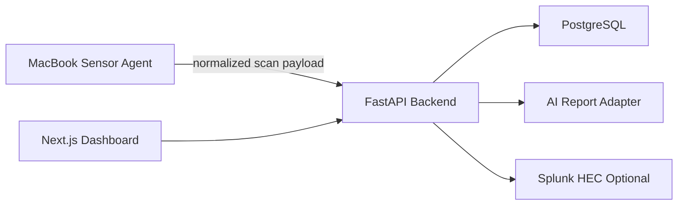

# Architecture

## Runtime Shape

## Local Sensor

The agent runs natively on macOS and uses Nmap for safe active discovery. It validates CIDR targets before executing scans, rejects public ranges by default, and limits scan size. The agent can also collect macOS Wi-Fi observations when the local wireless tooling exposes scan data.

The API receives normalized observations only:

- Asset identifiers: IP, optional MAC, vendor, hostname, OS guess, device type.
- Service observations: protocol, port, state, service name, product, version.
- Wi-Fi observations: SSID, BSSID, channel, signal, encryption.

Raw scanner output is intentionally not submitted to the backend by the default client.

## Backend

FastAPI owns ingestion, inventory merge logic, finding generation, reporting, and exports. PostgreSQL is the durable store. Alembic migrations define the initial schema.

Core tables:

- `sites`
- `sensors`
- `scan_runs`
- `assets`
- `asset_observations`
- `services`
- `wifi_networks`
- `findings`
- `reports`
- `users`
- `audit_logs`

## Detection Rules

Version one includes deterministic findings for:

- New devices.
- Missing devices in the scanned CIDR.
- Unknown vendors.
- Risky open ports.
- Open port changes.
- Weak or open Wi-Fi networks.
- Duplicate SSID with a newly observed BSSID.

Suspicious scan-like behavior is left as a future rule because the MVP does not yet collect netflow or firewall/session telemetry.

## AI Boundary

The AI provider receives minimized finding payloads, not raw Nmap output, packet data, or full scan logs. The default provider is `mock`, which gives deterministic report output for local development. A generic HTTP provider can be enabled with `AI_PROVIDER=http` and `AI_ENDPOINT`.

## Future SecOpsAI Cloud Integration

Cloud sync should sit behind a dedicated exporter interface and reuse the same normalized finding/report payloads. Multi-tenancy, billing, fleet management, and remote update orchestration are intentionally out of scope for this MVP.
