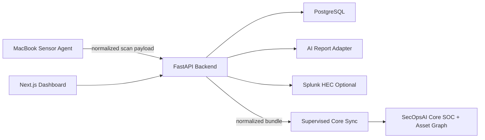

# Architecture

## Runtime Shape

## Local Sensor

The agent runs natively on macOS or Linux and uses Nmap for safe active
discovery. It validates CIDR targets before executing scans, rejects public
ranges by default, and limits scan size. Optional Wi-Fi inventory uses the
legacy macOS `airport` utility or Linux `iw` in managed mode. Capability checks
are explicit; unavailable tooling or permission fails visibly instead of
creating a false empty inventory.

The API receives normalized observations only:

- Asset identifiers: IP, optional MAC, vendor, hostname, OS guess, device type.
- Service observations: protocol, port, state, service name, product, version.
- Wi-Fi observations: SSID, BSSID, channel, signal in dBm, encryption, source.

Raw scanner output is intentionally not submitted to the backend by the default client.

## Backend

FastAPI owns ingestion, inventory merge logic, finding generation, reporting, and exports. PostgreSQL is the durable store. Alembic migrations define the initial schema.

The dashboard exposes the append-only audit stream for pilot operations. The local helper can create an owner-readable diagnostics bundle containing release, dependency, API, worker, and redacted log state for support recovery.

Process liveness (`/healthz`) is independent of PostgreSQL. Readiness
(`/readyz`) requires a successful database query and exact Alembic head, so a
deployment with stale schema cannot be treated as usable. The authenticated
system-status surface reports safe build, environment, schema, and AI-provider
metadata. Release builds use a locked Python dependency set and CI validates
schema drift against PostgreSQL before deployment.

Core tables:

- `organizations`
- `organization_memberships`
- `sites`
- `sensors`
- `sensor_enrollments`
- `scan_runs`
- `assets`
- `asset_observations`
- `services`
- `wifi_networks`
- `baseline_rules`
- `findings`
- `reports`
- `users`
- `audit_logs`
- `scan_schedules`
- `notification_endpoints`
- `notification_deliveries`
- `account_access_tokens`

## Detection Rules

Version one includes deterministic findings for:

- New devices.
- Missing devices in the scanned CIDR.
- Unknown vendors.
- Risky open ports.
- Open port changes.
- Weak or open Wi-Fi networks.
- Duplicate SSID with a newly observed BSSID.

Operators can approve known assets, accepted services, and trusted BSSIDs with site-scoped baseline rules. Asset approval acknowledges new-device and unknown-vendor noise. Service approval is exact to an asset, port, and protocol. BSSID approval suppresses duplicate-SSID noise but intentionally leaves weak/open-encryption findings active. Rules can expire or be disabled, and disabling a rule reopens findings acknowledged by that rule.

Suspicious scan-like behavior is left as a future rule because the MVP does not yet collect netflow or firewall/session telemetry.

## AI Boundary

The AI provider receives minimized finding payloads, not raw Nmap output, packet data, or full scan logs. The default provider is `mock`, which gives deterministic report output for local development. OpenAI Structured Outputs can be enabled with `AI_PROVIDER=openai`, `AI_API_KEY`, and `AI_MODEL`. A generic HTTP provider remains available with `AI_PROVIDER=http` and `AI_ENDPOINT`.

## SecOpsAI Core Integration

Edge exports the versioned `secopsai.edge.bundle.v1` contract. A supervised launchd/systemd timer can export the normalized graph and findings from the hosted or local Edge API and import them into Core's SQLite SOC/graph store. The service is one-way, idempotent, separately logged, and does not share databases or move raw scanner output. Each export is limited to the authenticated Edge workspace and carries that workspace identifier in `source_instance`; Core can therefore keep imports from different customers distinct. Hosted Core ingestion, billing, fleet management, and remote update orchestration remain later SaaS milestones.

## Workspace Boundary

Users are global identities and receive one or more organization memberships with an independent
`owner`, `admin`, or `viewer` role. Browser sessions contain a signed organization claim, but the
API revalidates the active user, session generation, organization, and membership on every request.
Sites belong to exactly one organization; all sensor and telemetry data is restricted through that
site. Organization-wide audit and notification records carry a direct organization key.

Existing single-pilot installations are migrated into a stable `Default Workspace`. This preserves
current sensor credentials and site IDs while allowing MSP operators to create additional isolated
customer workspaces. The legacy administrator token remains scoped to the default workspace for
interactive/API use; only the internal due-job runners may process all workspaces in one invocation.
